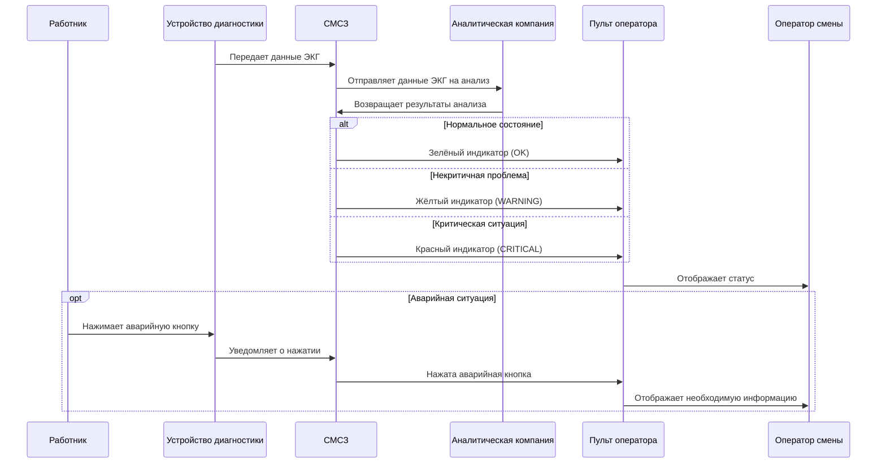

# Содержание

* [История изменений](#история-изменений)
* [1. Введение](#1-введение)
    * [1.1. Цели](#11-цели)
    * [1.2. Границы применения](#12-границы-применения)
    * [1.3. Термины и аббревиатуры](#13-термины-и-аббревиатуры)
    * [1.4. Ссылки](#14-ссылки)
    * [1.5. Краткий обзор](#15-краткий-обзор)
* [2. Общее описание](#2-общее-описание)
    * [2.1. Описание изделия](#21-описание-изделия)
    * [2.2. Функции изделия](#22-функции-изделия)
    * [2.3. Характеристики пользователей](#23-характеристики-пользователей)
    * [2.4. Ограничения](#24-ограничения)
    * [2.5. Предположения и зависимости](#25-предположения-и-зависимости)
* [3. Детальные требования](#3-детальные-требования)
    * [3.1. Функциональные требования](#31-функциональные-требования)
        * [3.1.1. Общий режим](#311-общий-режим)
            * [3.1.1.1. Требования внешних интерфейсов](#3111-требования-внешних-интерфейсов)
                * [3.1.1.1.1. Интерфейсы пользователя](#31111-интерфейсы-пользователя)
                * [3.1.1.1.2. Интерфейсы аппаратных средств ЭВМ](#31112-интерфейсы-аппаратных-средств-эвм)
                * [3.1.1.1.3. Интерфейсы программного обеспечения](#31113-интерфейсы-программного-обеспечения)
                * [3.1.1.1.4. Интерфейсы связи](#31114-интерфейсы-связи)
            * [3.1.1.2. Функциональные требования](#3112-функциональные-требования)
                * [3.1.1.2.1. Функции для Наблюдаемого лица](#31121-функции-для-наблюдаемого-лица)
                * [3.1.1.2.2. Функции для Наблюдателя](#31122-функции-для-наблюдателя)
                * [3.1.1.2.3. Функции для Системного администратора](#31123-функции-для-системного-администратора)
            * [3.1.1.3. Требования исполнения](#3113-требования-исполнения)
                * [3.1.1.3.1. Уведомления и оповещения](#31131-уведомления-и-оповещения)
                * [3.1.1.3.2. Обработка и передача данных](#31132-обработка-и-передача-данных)
                * [3.1.1.3.3. Обновление и доступ к информации](#31133-обновление-и-доступ-к-информации)
        * [3.1.2. Режим предприятия](#312-режим-предприятия)
            * [3.1.2.1. Требования внешних интерфейсов](#3121-требования-внешних-интерфейсов)
                * [3.1.2.1.1. Интерфейсы пользователя](#31211-интерфейсы-пользователя)
                * [3.1.2.1.1.1. Интерфейс Наблюдателя.](#312111-интерфейс-наблюдателя)
                * [3.1.2.1.1.2. Интерфейс Системного администратора.](#312112-интерфейс-системного-администратора)
                * [3.1.2.1.2. Интерфейсы аппаратных средств ЭВМ](#31212-интерфейсы-аппаратных-средств-эвм)
                * [3.1.2.1.3. Интерфейсы программного обеспечения](#31213-интерфейсы-программного-обеспечения)
                * [3.1.2.1.4. Интерфейсы связи](#31214-интерфейсы-связи)
            * [3.1.2.2. Функциональные требования](#3122-функциональные-требования)
                * [3.1.2.2.1. Функции для Наблюдаемого лица](#31221-функции-для-наблюдаемого-лица)
                * [3.1.2.2.2. Функции для Наблюдателя](#31222-функции-для-наблюдателя)
                * [3.1.2.2.3. Функции для Системного администратора](#31223-функции-для-системного-администратора)
            * [3.1.2.3. Требования исполнения](#3123-требования-исполнения)
                * [3.1.2.3.1. Уведомления и оповещения](#31231-уведомления-и-оповещения)
                * [3.1.2.3.2. Обработка и передача данных](#31232-обработка-и-передача-данных)
                * [3.1.2.3.3. Обновление и доступ к информации](#31233-обновление-и-доступ-к-информации)
        * [3.1.3. Режим наблюдения за пожилыми людьми](#313-режим-наблюдения-за-пожилыми-людьми)
            * [3.1.3.1. Требования внешних интерфейсов](#3131-требования-внешних-интерфейсов)
                * [3.1.3.1.1. Интерфейсы пользователя](#31311-интерфейсы-пользователя)
                * [3.1.3.1.1.1. Интерфейс Наблюдателя.](#313111-интерфейс-наблюдателя)
                * [3.1.3.1.1.2. Интерфейс Системного администратора.](#313112-интерфейс-системного-администратора)
                * [3.1.3.1.2. Интерфейсы аппаратных средств ЭВМ](#31312-интерфейсы-аппаратных-средств-эвм)
                * [3.1.3.1.3. Интерфейсы программного обеспечения](#31313-интерфейсы-программного-обеспечения)
                * [3.1.3.1.4. Интерфейсы связи](#31314-интерфейсы-связи)
            * [3.1.3.2. Функциональные требования](#3132-функциональные-требования)
                * [3.1.3.2.1. Функции для Наблюдаемого лица](#31321-функции-для-наблюдаемого-лица)
                * [3.1.3.2.2. Функции для Наблюдателя](#31322-функции-для-наблюдателя)
                * [3.1.3.2.3. Функции для Системного администратора](#31323-функции-для-системного-администратора)
            * [3.1.3.3. Требования исполнения](#3133-требования-исполнения)
                * [3.1.3.3.1. Уведомления и оповещения](#31331-уведомления-и-оповещения)
                * [3.1.3.3.2. Обработка и передача данных](#31332-обработка-и-передача-данных)
                * [3.1.3.3.3. Обновление и доступ к информации](#31333-обновление-и-доступ-к-информации)
    * [3.2. Надежность](#32-надежность)
    * [3.3. Производительность](#33-производительность)
    * [3.4. Ремонтопригодность](#34-ремонтопригодность)
    * [3.5. Ограничения проекта](#35-ограничения-проекта)
    * [3.6. Требования к пользовательской документации](#36-требования-к-пользовательской-документации)
    * [3.7. Используемые компоненты](#37-используемые-компоненты)
    * [3.8. Требования лицензирования](#38-требования-лицензирования)
    * [3.9. Применимые стандарты](#39-применимые-стандарты)
* [Индекс](#индекс)
* [Приложения](#приложения)
    * [Диаграммы](#диаграммы)

---

# История изменений

| Дата       | Версия | Описание                              | Автор(ы)                                                                                     |
|------------|--------|---------------------------------------|----------------------------------------------------------------------------------------------|
| 2024-10-02 | 0.1    | Начальная ревизия                     | Черных Андрей Андреевич, Коновалов Сергей Александрович, Малышев Антон Александрович |
| 2024-10-23 | 0.2    | Определение функциональных требований | Черных Андрей Андреевич, Коновалов Сергей Александрович, Малышев Антон Александрович |
| 2024-11-06 | 0.3    | Изменение требований системы          | Черных Андрей Андреевич, Коновалов Сергей Александрович, Малышев Антон Александрович |

---

# 1. Введение

Данный документ описывает спецификацию требований к программному обеспечению (СТПО) для системы мониторинга состояния
здоровья (СМСЗ). В нем описывается область применения системы, функциональные и нефункциональные требования к
программному обеспечению, ограничения на проектирование и системные интерфейсы.

## 1.1. Цели

Документ охватывает исключительно функциональность СМСЗ и не включает функциональность внешних систем, таких как
аналитические инструменты или системы экстренного оповещения.

## 1.2. Границы применения

СМСЗ предназначена для отслеживания отклонений, связанных с состоянием здоровья Наблюдаемых лиц, путем наблюдения за их
медицинским состоянием с использованием датчиков ЭКГ. Она обеспечивает непрерывный контроль состояния здоровья в
реальном времени и оперативное реагирование на критические изменения через уведомление наблюдателей.

Система может использоваться как для мониторинга состояния здоровья работников на предприятии, так и для наблюдения за
состоянием пожилых людей в домашних условиях и является инструментом, облегчающим принятие решений на основе полученных
данных; система не принимает решения самостоятельно.

## 1.3. Термины и аббревиатуры

| Термин/Аббревиатура | Определение                            |
|---------------------|----------------------------------------|
| СМСЗ                | Система мониторинга состояния здоровья |
| ЭКГ                 | Электрокардиография                    |
| УД                  | Устройство диагностики                 |
| АК                  | Аналитическая компания                 |
| ЧС                  | Чрезвычайная ситуация                  |

## 1.4. Ссылки

| Обозначение | Расшифровка       |
|-------------|-------------------|
| [IEEE-830]  | IEEE Std 830-1998 |

## 1.5. Краткий обзор

Глава 2 описывает общие функции системы, ограничения, которые должны соблюдаться, и предположения, принятые при
определении требований.

Глава 3 описывает функциональные и нефункциональные требования, а также требования к надежности, производительности и
удобству обслуживания системы с такой степенью детализации, которая позволит инженерам-проектировщикам спроектировать
систему, соответствующую этим требованиям, а специалистам по тестированию — оценить, удовлетворяет ли им система.

Документ структурирован в соответствии со стандартом IEEE 830-1998 [IEEE-830].

---

# 2. Общее описание

## 2.1. Описание изделия

- **Интерфейсы системы**: Система взаимодействует с внутренними или внешними информационными системами, предоставляющими
  информацию о Наблюдаемых лицах. Также предусмотрена интеграция с почтовыми сервисами и операторами сотовой связи для
  отправки уведомлений Наблюдателю системы.

- **Интерфейсы пользователя**: Пользователи взаимодействуют с системой через интерфейс прикладной программы. Интерфейс
  поддерживает функционал для отслеживания состояния Наблюдаемого лица, а также получения внутренних уведомлений при
  ухудшении его состояния.

- **Интерфейсы аппаратных средств ЭВМ**: Система может быть развернута на серверных мощностях предприятия, либо на
  устройстве для частного пользования, взаимодействуя с устройствами приема сигналов УД.

- **Интерфейсы программного обеспечения**: Система взаимодействует с АК для получения оценки состояния Наблюдаемого
  лица, и с СУДБ для хранения показаний УД и результатов, полученных от АК.

- **Интерфейсы коммуникаций**: Взаимодействие системы с пользователями происходит через аварийную кнопку на УД,
  внутренние уведомления в программе или через электронную почту для оповещения Наблюдателя об ухудшении состояния
  Наблюдаемого лица.

- **Ограничения памяти**: Система должна поддерживать хранение необходимого количества УД, и архива их показаний.

- **Действия**: Система позволяет отслеживать состояние Наблюдаемых лиц и уведомлять Наблюдателя об ухудшении состояния
  Наблюдаемого лица.

## 2.2. Функции изделия

**Поддерживаемые функции**:

- **Отслеживание состояния здоровья Наблюдаемых лиц**: Система выполняет мониторинг состояния здоровья Наблюдаемых лиц
  (работников предприятия или пожилых людей в домашних условиях) с помощью устройств диагностики (УД), обеспечивая
  непрерывное наблюдение в реальном времени.

- **Аварийное оповещение**: При нажатии Наблюдаемым лицом аварийной кнопки на УД, система отправляет сигнал, уведомляя
  наблюдателей (Наблюдателя предприятия или родственников) о потенциальной чрезвычайной ситуации.

- **Передача данных ЭКГ**: Система отправляет данные ЭКГ, собранные с помощью УД, в аналитическую компанию (АК) для
  дальнейшего анализа состояния здоровья Наблюдаемого лица.

- **Получение результатов анализа**: Система получает от АК один из трех возможных результатов (OK, WARNING, CRITICAL),
  отражающих текущее состояние здоровья Наблюдаемого лица.

- **Передача результатов анализа**: Система отображает результаты анализа состояния здоровья Наблюдаемых лиц на
  интерфейсах нескольких наблюдателей (Наблюдателей предприятия и/или родственников). Результаты могут быть представлены
  в виде цветовых индикаторов и/или текстовых сообщений, информирующих о текущем состоянии здоровья Наблюдаемых лиц.

**Неподдерживаемые функции**:

- **Принятие решений**: Система не принимает самостоятельных решений на основе данных, собираемых с помощью УД.

- **Анализ данных**: Система не выполняет анализ данных, собираемых с помощью УД; обработка данных выполняется
  исключительно АК.

- **Обработка недостоверных данных**: Система не способна отличить случайное нажатие Наблюдаемым лицом аварийной кнопки
  на УД от намеренного.

## 2.3. Характеристики пользователей

Система предназначена для использования различными пользователями, которых можно разделить на несколько категорий в
зависимости от их функций и ответственности в рамках СМСЗ:

| Пользователь            | Функции и ответственность                                                                                                                 | Квалификация                                                                                                                    |
|-------------------------|-------------------------------------------------------------------------------------------------------------------------------------------|---------------------------------------------------------------------------------------------------------------------------------|
| Наблюдаемое лицо        | Носит УД и подает сигнал тревоги Наблюдателю в случае ухудшения состояния здоровья или экстренной ситуации.                               | Прошел инструктаж по использованию УД и действиям в случае критической ситуации                                                 |
| Наблюдатель             | Контролирует состояние здоровья Наблюдаемых лиц, принимает экстренные сигналы и организует помощь при возникновении критических ситуаций. | Прошел обучение по экстренному реагированию на критические ситуации и протоколам работы с СМСЗ                                  |
| Системный администратор | Устанавливает и обслуживает систему, обеспечивает ее бесперебойное функционирование и корректное взаимодействие с внешними системами.     | Обладает навыками системного администрирования, знаком с медицинскими информационными системами и имеет техническое образование |

## 2.4. Ограничения

- СМСЗ является системой реального времени, что означает строгие требования к скорости обработки данных и
  своевременности отклика. Все события должны обрабатываться в рамках допустимых временных интервалов, включая:
    - Получение данных от УД;
    - Обработку сигнала о нажатии на аварийную кнопку на УД;
    - Передачу данных в АК;
    - Обработку результатов анализа от АК.
    - Уведомление Наблюдателей.

- Вся аналитика данных ЭКГ осуществляется одной закрепленной аналитической компанией (АК). Все взаимодействие с АК
  должно учитывать это ограничение, а алгоритмы передачи данных и обработки ответов адаптированы под постоянного
  партнера.

- Для обеспечения безопасности и конфиденциальности данных используется TLS (Transport Layer Security) для шифрования
  передаваемой информации между СМСЗ и внешними системами, включая УД и АК.

## 2.5. Предположения и зависимости

- СМСЗ зависит от корректной работы УД.
    - Система не может функционировать без активных УД на каждом работнике.
    - Предполагается, что УД будут иметь достаточный уровень заряда батареи для работы на протяжении всей смены.

- СМСЗ опирается на аналитику, предоставляемую сторонней АК, которая обрабатывает данные ЭКГ.
    - Система не может функционировать в случае неработоспособности АК.
    - Предполагается, что АК будет предоставлять результаты анализа в установленные сроки без задержек.

- СМСЗ рассчитана на обработку данных не более чем 100 УД одновременно.

- СМСЗ должна поддерживать работу с несколькими наблюдателями, что означает возможность получения уведомлений
  несколькими лицами, такими как несколько Наблюдателей на предприятии или несколько родственников для одного или
  нескольких Наблюдаемых лиц.

---

# 3. Детальные требования

## 3.1. Функциональные требования

В этом разделе приведены все требования к СМСЗ, включая как функциональные, так и нефункциональные. Каждое требование
обладает следующими характеристиками:

- **Идентификатор**: Уникальный номер, однозначно идентифицирующий требование в документации СМСЗ.
- **Описание**: Подробное изложение сути требования.
- **Приоритет**: Устанавливает порядок реализации требований. Приоритеты обозначаются уровнями (от высшего к низшему):
  "1", "2" и "3".
- **Ссылки**: Содержит ссылки на другие связанные требования.

Требования структурированы по режимам работы системы и категориям пользователей, с выделением требований к внешним
интерфейсам и требованиям исполнения.

### 3.1.1. Общий режим

#### 3.1.1.1. Требования внешних интерфейсов

##### 3.1.1.1.1. Интерфейсы пользователя

- **идентификатор**: 01.01.01.01
- **описание**: Интерфейс системы должен быть разделен и уникален для 3 типов пользователей:
    - Наблюдаемое лицо
    - Наблюдатель
    - Системный администратор
- **приоритет**: 1
- **ссылки**:
    
- **идентификатор**: 01.01.01.02
- **описание**: Интерфейс Системного администратора должен предоставлять все необходимые инструменты для отладки системы
  и её диагностики.
- **приоритет**: 2
- **ссылки**:
    
- **идентификатор**: 01.01.01.03
- **описание**: Интерфейс взаимодействия Наблюдаемого лица с устройством диагностики должен определяться используемой
  моделью устройства диагностики.
- **приоритет**: 1
- **ссылки**:

##### 3.1.1.1.2. Интерфейсы аппаратных средств ЭВМ

- **идентификатор**: 01.01.02.01
- **описание**: Система должна поддерживать:
    - Устройства диагностики, внесенные в реестр используемых системой, в частности активные в момент работы системы.
    - Устройства приема, обработки и переадресации сигналов, отправляемых с УД.
    - Базы данных и журналы состояний, формирующиеся в процессе работы системы.
- **приоритет**: 2
- **ссылки**:

##### 3.1.1.1.3. Интерфейсы программного обеспечения

- **идентификатор**: 01.01.03.01
- **описание**: Система использует:
    - Продукт АК для определения состояния сотрудника по имеющимся показаниям УД.
    - СУБД для организации БД учета используемых УД, получаемых показаний с УД, ответов АК и журналов событий.
- **приоритет**: 3
- **ссылки**:

##### 3.1.1.1.4. Интерфейсы связи

- **идентификатор**: 01.01.04.01
- **описание**: Прием и отправка данных, собираемых устройствами диагностики, должны быть реализованы по технологии
  Wi-Fi.
- **приоритет**: 3
- **ссылки**:
    
- **идентификатор**: 01.01.04.02
- **описание**: Устройства приема данных с УД имеют радиус приема сигнала достаточный для покрытия одной единицы
  помещения.
- **приоритет**: 3
- **ссылки**:
    
- **идентификатор**: 01.01.04.03
- **описание**: Коммуникация между СМСЗ и АК реализована в соответствии с договором об оказании услуг от АК.
- **приоритет**: 3
- **ссылки**:

#### 3.1.1.2. Функциональные требования

##### 3.1.1.2.1. Функции для Наблюдаемого лица

- **идентификатор**: 01.02.01.01
- **описание**: Система должна принимать и обрабатывать аварийный сигнал от УД, когда Наблюдаемое лицо нажимает
  аварийную кнопку, и немедленно передавать его Наблюдателю.
- **приоритет**: 1
- **ссылки**:
    
- **идентификатор**: 01.02.01.02
- **описание**: Система должна уведомлять Наблюдаемое лицо о неисправности его УД или потере соединения с системой.
- **приоритет**: 2
- **ссылки**:

##### 3.1.1.2.2. Функции для Наблюдателя

- **идентификатор**: 01.02.02.01
- **описание**: Система должна в режиме реального времени отображать статус соединения с АК и УД Наблюдаемого лица.
- **приоритет**: 1
- **ссылки**:
    
- **идентификатор**: 01.02.02.02
- **описание**: Система должна уведомлять Наблюдателя о потере соединения с АК и УД Наблюдаемого лица.
- **приоритет**: 2
- **ссылки**:
    
- **идентификатор**: 01.02.02.03
- **описание**: Система должна отображать информацию о состоянии здоровья каждого Наблюдаемого лица на интерфейсе в
  режиме реального времени.
- **приоритет**: 1
- **ссылки**:
    
- **идентификатор**: 02.02.02.04
- **описание**: Система должна отображать результаты анализа состояния здоровья работников в виде цветовых индикаторов
  (OK, WARNING, CRITICAL).
- **приоритет**: 2
- **ссылки**:
    
- **идентификатор**: 01.02.02.05
- **описание**: Система должна предоставлять Наблюдателю доступ к журналу событий, где регистрируются любые изменения
  состояния здоровья Наблюдаемого лица, передача данных и аварийные сигналы.
- **приоритет**: 2
- **ссылки**:
    
- **идентификатор**: 01.02.02.06
- **описание**: Система должна обеспечивать доступ к полной истории состояний каждого Наблюдаемого лица, включая
  информацию о предыдущих аварийных сигналах.
- **приоритет**: 3
- **ссылки**:
    
- **идентификатор**: 01.02.02.07
- **описание**: Система должна реагировать на аварийный сигнал независимо от данных ЭКГ, включая случаи временной потери
  данных.
- **приоритет**: 1
- **ссылки**:

##### 3.1.1.2.3. Функции для Системного администратора

- **идентификатор**: 01.02.03.01
- **описание**: Система должна позволять просматривать и анализировать журнал событий.
- **приоритет**: 1
- **ссылки**:
    
- **идентификатор**: 01.02.03.02
- **описание**: Система должна обеспечивать возможность обновления программного обеспечения системы и устройств
  диагностики.
- **приоритет**: 2
- **ссылки**:
    
- **идентификатор**: 01.02.03.03
- **описание**: Система должна предоставлять возможность управлять учетными записями пользователей, создавая новые
  профили и удаляя устаревшие.
- **приоритет**: 2
- **ссылки**:
    
- **идентификатор**: 01.02.03.04
- **описание**: Система должна поддерживать добавление новых устройств диагностики (УД) и удаление старых или
  неисправных.
- **приоритет**: 3
- **ссылки**:
    
- **идентификатор**: 01.02.03.05
- **описание**: Система должна позволять настраивать и управлять базой данных.
- **приоритет**: 3
- **ссылки**:
    
- **идентификатор**: 01.02.03.06
- **описание**: Система должна предоставлять возможность резервного копирования базы данных.
- **приоритет**: 2
- **ссылки**:
    
- **идентификатор**: 01.02.03.07
- **описание**: Система должна поддерживать восстановление после сбоев с использованием резервных копий данных.
- **приоритет**: 1
- **ссылки**:

#### 3.1.1.3. Требования исполнения

##### 3.1.1.3.1. Уведомления и оповещения

- **идентификатор**: 01.03.01.01
- **описание**: Система должна уведомлять Наблюдателя в течение 5 секунд после потери соединения с устройством
  диагностики (УД).
- **приоритет**: 1
- **ссылки**:
    
- **идентификатор**: 01.03.01.02
- **описание**: Система должна уведомлять Наблюдателя в течение 5 секунд после нажатия аварийной кнопки на устройстве
  диагностики (УД).
- **приоритет**: 1
- **ссылки**:

##### 3.1.1.3.2. Обработка и передача данных

- **идентификатор**: 01.03.02.01
- **описание**: Система должна обеспечивать обработку данных ЭКГ, поступающих с каждого устройства диагностики (УД),
  каждые 3 секунды.
- **приоритет**: 2
- **ссылки**:
    
- **идентификатор**: 01.03.02.02
- **описание**: Система должна обеспечивать передачу собранных данных ЭКГ в аналитическую компанию (АК) каждые 3
  секунды.
- **приоритет**: 2
- **ссылки**:
    
- **идентификатор**: 01.03.02.03
- **описание**: Система должна получать результаты анализа ЭКГ от АК не позднее чем через 10 секунд с момента отправки
  данных.
- **приоритет**: 2
- **ссылки**:
    
- **идентификатор**: 01.03.02.04
- **описание**: Система должна поддерживать работу с несколькими Наблюдателями.
- **приоритет**: 2
- **ссылки**:
    
- **идентификатор**: 01.03.02.05
- **описание**: Система должна использовать TLS (Transport Layer Security) для шифрования передаваемой информации между
  СМСЗ и внешними системами, включая УД и АК.
- **приоритет**: 2
- **ссылки**:

##### 3.1.1.3.3. Обновление и доступ к информации

- **идентификатор**: 01.03.03.01
- **описание**: Система должна позволять Наблюдателю просматривать историю состояний каждого работника за последние 3
  месяца.
- **приоритет**: 3
- **ссылки**:

### 3.1.2. Режим предприятия

#### 3.1.2.1. Требования внешних интерфейсов

##### 3.1.2.1.1. Интерфейсы пользователя

##### 3.1.2.1.1.1. Интерфейс Наблюдателя

- **идентификатор**: 02.01.01.01
- **описание**: Интерфейс личного кабинета Наблюдателя должен содержать:
    - Идентификатор Наблюдателя
    - Идентификаторы смен, которые отслеживались Наблюдателем
- **приоритет**: 3
- **ссылки**: 01.01.01.01
    
- **идентификатор**: 02.01.01.02
- **описание**: Интерфейс рабочего пространства Наблюдателя должен содержать:
    - Идентификатор смены, работающей на предприятии в данный момент времени.
    - Окно системы оповещений, содержащее уведомления о переходе состояния Наблюдаемого лица в "WARNING" или "CRITICAL".
    - Интерфейс кнопки аварийного оповещения.
    - Таблицу карт состояний Наблюдаемых лиц и закрепленные за ними устройства диагностики.
- **приоритет**: 3
- **ссылки**:
    
- **идентификатор**: 02.01.01.03
- **описание**: Карта состояния должна содержать:
    - Идентификатор устройства диагностики.
    - Идентификатор Наблюдаемого лица.
    - Местонахождение устройства диагностики.
    - 3 возможных индикатора состояния Наблюдаемого лица:
        - Зеленый (OK): состояние в норме
        - Желтый (WARNING): состояние требует внимания
        - Красный (CRITICAL): критическое состояние
- **приоритет**: 3
- **ссылки**: 02.01.01.02

##### 3.1.2.1.1.2. Интерфейс Системного администратора

- **идентификатор**: 02.01.02.01
- **описание**:      Интерфейс личного кабинета администратора позволяет просматривать личные кабинеты других
  пользователей системы, а также предоставляет доступ к архивам системы.
- **приоритет**:     3
- **ссылки**:        01.01.01.02
    
- **идентификатор**: 02.01.02.02
- **описание**:      Интерфейс режима технического обслуживания должен содержать:
    - Режим отладки устройств диагностики.
    - Режим отладки дополнительной аппаратуры.
    - Режим работы с учетными записями пользователей системы.
- **приоритет**:     3
- **ссылки**:        01.01.01.02

##### 3.1.2.1.2. Интерфейсы аппаратных средств ЭВМ

- **идентификатор**: 02.01.03.01
- **описание**:  Система должна поддерживать модель УД для предприятий.
- **приоритет**:     3
- **ссылки**:

##### 3.1.2.1.3. Интерфейсы программного обеспечения

- **идентификатор**: 02.01.04.01
- **описание**:  Система реализована на базе операционной системы X.
- **приоритет**:     3
- **ссылки**:

##### 3.1.2.1.4. Интерфейсы связи

- **идентификатор**: 02.01.05.01
- **описание**:  Устройства, поддерживаемые системой и принимающие участие в её работе, должны формировать локальную
  сеть на предприятии.
- **приоритет**:     3
- **ссылки**:

#### 3.1.2.2. Функциональные требования

##### 3.1.2.2.1. Функции для Наблюдаемого лица

Требования не предъявляются.

##### 3.1.2.2.2. Функции для Наблюдателя

- **идентификатор**: 02.02.02.01
- **описание**: Система должна позволять вручную проверять состояние соединения с устройствами диагностики и
  аналитической компанией.
- **приоритет**: 3
- **ссылки**:
    
- **идентификатор**: 02.02.02.02
- **описание**: Система должна отправлять звуковое и визуальное уведомление оператору предприятия при получении
  аварийного сигнала от любого работника.
- **приоритет**: 1
- **ссылки**:

##### 3.1.2.2.3. Функции для Системного администратора

- **идентификатор**: 02.02.03.01
- **описание**: Система должна быть установлена на сервере предприятия
- **приоритет**: 1
- **ссылки**:

#### 3.1.2.3. Требования исполнения

##### 3.1.2.3.1. Уведомления и оповещения

- **идентификатор**: 02.03.01.01
- **описание**: Система должна обновлять цветовые индикаторы на пульте оператора предприятия не позднее 3 секунд после
  получения результата анализа.
- **приоритет**: 1
- **ссылки**:

##### 3.1.2.3.2. Обработка и передача данных

- **идентификатор**: 02.03.02.01
- **описание**: Система должна обеспечивать обработку данных от не менее чем 100 УД, работающих одновременно на
  территории предприятия, без снижения производительности.
- **приоритет**: 1
- **ссылки**:

##### 3.1.2.3.3. Обновление и доступ к информации

Требования не предъявляются.

### 3.1.3. Режим наблюдения за пожилыми людьми

#### 3.1.3.1. Требования внешних интерфейсов

##### 3.1.3.1.1. Интерфейсы пользователя

##### 3.1.3.1.1.1. Интерфейс Наблюдателя

- **идентификатор**: 03.01.01.01
- **описание**:      Любая из страниц интерфейса Наблюдателя должна содержать кнопку экстренного вызова скорой
  помощи.
- **приоритет**:     1
- **ссылки**:        01.01.01.01
    
- **идентификатор**: 03.01.01.02
- **описание**:      Интерфейс личного кабинета Наблюдателя должен содержать:
    - Историю изменений состояния Наблюдаемых лиц.
    - Интерфейс кнопки экстренного вызова скорой помощи.
- **приоритет**:     3
- **ссылки**:        01.01.01.01, 03.01.01.01
    
- **идентификатор**: 03.01.01.03
- **описание**:      Интерфейс рабочего пространства Наблюдателя должен содержать:
    - Окно системы оповещений, содержащее уведомления о переходе состояния Наблюдаемого лица в "WARNING" или "CRITICAL".
    - Интерфейс кнопки экстренного вызова скорой помощи.
    - Таблицу карт состояний Наблюдаемых лиц и закрепленные за ними устройства диагностики.
- **приоритет**:     3
- **ссылки**:        01.01.01.01
    
- **идентификатор**: 03.01.01.04
- **описание**:      Карта состояния должна содержать:
    - Идентификатор устройства диагностики.
    - Идентификатор Наблюдаемого лица.
    - Местонахождение устройства диагностики.
    - 3 возможных индикатора состояния Наблюдаемого лица:
        - Зеленый (OK): состояние в норме
        - Желтый (WARNING): состояние требует внимания
        - Красный (CRITICAL): критическое состояние
- **приоритет**:     3
- **ссылки**:        03.01.01.03

##### 3.1.3.1.1.2. Интерфейс Системного администратора

- **идентификатор**: 03.01.02.01
- **описание**:      Интерфейс личного кабинета Системного администратора позволяет просматривать личные кабинеты других
  пользователей системы, а также предоставляет доступ к архивам системы.
- **приоритет**:     3
- **ссылки**:        01.01.01.02
    
- **идентификатор**: 03.01.02.02
- **описание**:      Интерфейс режима технического обслуживания должен содержать:
    - Режим отладки устройств диагностики.
    - Режим отладки дополнительной аппаратуры.
    - Режим работы с учетными записями пользователей системы.
- **приоритет**:     3
- **ссылки**:        01.01.01.02

##### 3.1.3.1.2. Интерфейсы аппаратных средств ЭВМ

- **идентификатор**: 03.01.03.01
- **описание**:  Система должна поддерживать модель УД для частного пользования.
- **приоритет**:     3
- **ссылки**:

##### 3.1.3.1.3. Интерфейсы программного обеспечения

- **идентификатор**: 03.01.04.01
- **описание**:  Система реализована на базе операционной системы Y.
- **приоритет**:     3
- **ссылки**:

##### 3.1.3.1.4. Интерфейсы связи

- **идентификатор**: 03.01.05.01
- **описание**:  Система должна поддерживать отправку уведомления об ухудшении состояния Наблюдаемого лица путём вызова
  Наблюдателя по сотовой связи.
- **приоритет**:     3
- **ссылки**:

#### 3.1.3.2. Функциональные требования

##### 3.1.3.2.1. Функции для Наблюдаемого лица

- **идентификатор**: 03.02.01.01
- **описание**: Система должна иметь возможность зарегистрировать номер телефона пациента в качестве Наблюдаемого лица.
- **приоритет**: 1
- **ссылки**:
    
- **идентификатор**: 03.02.01.02
- **описание**: Система должна иметь возможность зарегистрировать адрес проживания пациента.
- **приоритет**: 1
- **ссылки**:
    
- **идентификатор**: 03.02.01.03
- **описание**: Система должна инициировать телефонный звонок пациенту при получении от него аварийного сигнала.
- **приоритет**: 1
- **ссылки**:
    
- **идентификатор**: 03.02.01.04
- **описание**: Система должна автоматически инициировать вызов скорой помощи по адресу проживания пациента, если с ним
  не удается связаться.
- **приоритет**: 1
- **ссылки**:

##### 3.1.3.2.2. Функции для Наблюдателя

- **идентификатор**: 03.02.02.01
- **описание**: Система должна иметь возможность зарегистрировать номер телефона родственника в качестве Наблюдателя.
- **приоритет**: 1
- **ссылки**:
    
- **идентификатор**: 03.02.02.02
- **описание**: Система должна инициировать телефонный звонок родственнику при получении аварийного сигнала от пациента.
- **приоритет**: 1
- **ссылки**:

##### 3.1.3.2.3. Функции для Системного администратора

- **идентификатор**: 03.02.03.01
- **описание**: Система должна быть установлена в квартире пожилого человека
- **приоритет**: 1
- **ссылки**:

#### 3.1.3.3. Требования исполнения

##### 3.1.3.3.1. Уведомления и оповещения

- **идентификатор**: 03.03.01.01
- **описание**: Система должна инициировать телефонный звонок родственнику в течение 5 секунд после нажатия аварийной
  кнопки на устройстве диагностики (УД).
- **приоритет**: 1
- **ссылки**: 01.03.01.02
    
- **идентификатор**: 03.03.01.02
- **описание**: Система должна обновлять цветовые индикаторы на устройстве родственника не позднее 3 секунд после
  получения результата анализа.
- **приоритет**: 1
- **ссылки**:
    
- **идентификатор**: 03.03.01.03
- **описание**: Система должна автоматически инициировать вызов скорой помощи в течение 30 секунд после последней
  неудачной попытки связаться с пациентом после получения от него аварийного сигнала.
- **приоритет**: 1
- **ссылки**:

##### 3.1.3.3.2. Обработка и передача данных

Требования не предъявляются.

##### 3.1.3.3.3. Обновление и доступ к информации

Требования не предъявляются.

## 3.2. Надежность

- **Доступность**: xx.xx%
- **MTBF**: подлежит уточнению.
- **MTTR**: подлежит уточнению.
- **Точность**: подлежит уточнению.
- **Макс. количество ошибок**: подлежит уточнению.

## 3.3. Производительность

- **Время отклика**: подлежит выяснению.
- **Пропускная способность**: подлежит выяснению.
- **Утилизация ресурсов**: подлежит выяснению.

## 3.4. Ремонтопригодность

[Требования к ремонтопригодности.]

## 3.5. Ограничения проекта

[Ограничения по проекту.]

## 3.6. Требования к пользовательской документации

[Требования к документации.]

## 3.7. Используемые компоненты

[Перечень приобретаемых компонентов.]

## 3.8. Требования лицензирования

[Требования по лицензированию.]

## 3.9. Применимые стандарты

[Применимые стандарты.]

---

# Индекс

[Индекс.]

# Приложения

## Диаграммы

1. Режим предприятия (Sequence Diagram)

