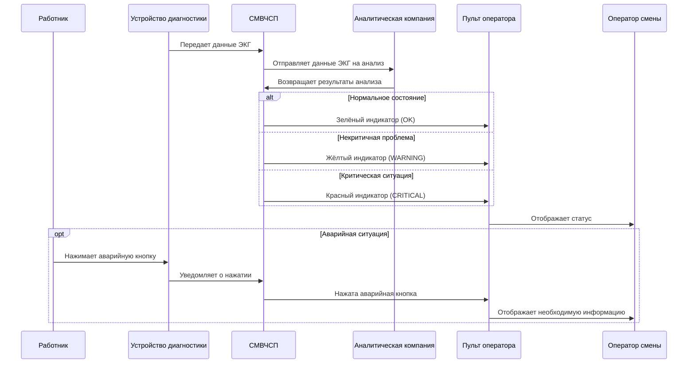

# Содержание

* [1. Введение](#1-введение)
    * [Цели](#цели)
    * [Границы применения](#границы-применения)
    * [Термины и аббревиатуры](#термины-и-аббревиатуры)
    * [Ссылки](#ссылки)
    * [Краткий обзор](#краткий-обзор)
* [2. Общее описание](#2-общее-описание)
    * [Описание изделия](#описание-изделия)
    * [Функции изделия](#функции-изделия)
    * [Характеристики пользователей](#характеристики-пользователей)
    * [Ограничения](#ограничения)
    * [Предположения и зависимости](#предположения-и-зависимости)
* [3. Детальные требования](#3-детальные-требования)
    * [Функциональные требования](#функциональные-требования)
    * [Надежность](#надежность)
    * [Производительность](#производительность)
    * [Ремонтопригодность](#ремонтопригодность)
    * [Ограничения проекта](#ограничения-проекта)
    * [Требования к пользовательской документации](#требования-к-пользовательской-документации)
    * [Используемые компоненты](#используемые-компоненты)
    * [Интерфейсы](#интерфейсы)
    * [Требования лицензирования](#требования-лицензирования)
    * [Применимые стандарты](#применимые-стандарты)
* [Индекс](#индекс)
* [Приложения](#приложения)
    * [Диаграммы](#диаграммы)

---

# История изменений

| Дата       | Версия | Описание                              | Автор(ы)                                                                                     |
|------------|--------|---------------------------------------|----------------------------------------------------------------------------------------------|
| 2024-10-02 | 0.1    | Начальная ревизия                     | Черных Андрей Андреевич, Коновалов Сергей Александрович, Малышев Антон Александрович |
| 2024-23-02 | 0.1    | Определение функциональных требований | Черных Андрей Андреевич, Коновалов Сергей Александрович, Малышев Антон Александрович |

---

# 1. Введение

Данный документ описывает спецификацию требований к программному обеспечению (СТПО) для системы мониторинга
возникновения чрезвычайных ситуаций на предприятии (СМВЧСП). В нем описывается область применения системы,
функциональные и нефункциональные требования к программному обеспечению, ограничения на проектирование и системные
интерфейсы.

## Цели

Документ охватывает исключительно функциональность системы мониторинга здоровья работников и не включает
функциональность внешних систем, таких как аналитические инструменты или системы экстренного оповещения.

## Границы применения

Система мониторинга возникновения чрезвычайных ситуаций на предприятии предназначена для отслеживания отклонений,
связанных с состоянием здоровья работников предприятия, путем наблюдения за их медицинским состоянием с использованием
датчиков ЭКГ.
Она обеспечивает непрерывный контроль здоровья работников в реальном времени и оперативное реагирование на критические
изменения в их состоянии через уведомление оператора.

Система применяется исключительно для мониторинга состояния здоровья работников и является инструментом, облегчающим
принятие решений на основе полученных данных; система не принимает решения самостоятельно.

## Термины и аббревиатуры

| Термин/Аббревиатура | Определение                                                            |
|---------------------|------------------------------------------------------------------------|
| СМВЧСП              | Система мониторинга возникновения чрезвычайных ситуаций на предприятии |
| ЭКГ                 | Электрокардиография                                                    |
| УД                  | Устройство диагностики                                                 |
| АК                  | Аналитическая компания                                                 |
| ЧС                  | Чрезвычайная ситуация                                                  |

## Ссылки

| Обозначение | Расшифровка       |
|-------------|-------------------|
| [IEEE-830]  | IEEE Std 830-1998 |

## Краткий обзор

Глава 2 описывает общие функции изделия, ограничения, которые должны соблюдаться, и предположения, принятые при
определении требований.

Глава 3 описывает функциональные и нефункциональные требования, а также требования к надежности, производительности и
удобству обслуживания изделия с такой степенью детализации, которая позволит инженерам-проектировщикам спроектировать
систему, соответствующую этим требованиям, а специалистам по тестированию — оценить, удовлетворяет ли им система.

Документ структурирован в соответствии со стандартом IEEE 830-1998 [IEEE-830].

---

# 2. Общее описание

## Описание изделия

- **Интерфейсы системы**: СМВЧС взаимодействует с внутренними информационными системами компании, такими как СУРП
  (система учета работников предприятия). Также предусмотрена интеграция с почтовыми сервисами для отправки уведомлений
  оператору системы.

- **Интерфейсы пользователя**: Пользователи взаимодействуют с системой через интерфейс прикладной программы. Интерфейс
  поддерживает функционал для отслеживания состояния работников предприятия, а также получения внутренних уведомлений о
  возникновении ЧС.

- **Интерфейсы аппаратных средств ЭВМ**: Система может быть развернута на серверных мощностях предприятия,
  взаимодействуя с устройствами приема сигналов УД.

- **Интерфейсы программного обеспечения**: СМВЧС взаимодействует с АК для получения оценки состояния работника, и с СУДБ
  для хранения показаний УД и результатов, полученных от АК.

- **Интерфейсы коммуникаций**: Взаимодействие системы с пользователями происходит через аварийную кнопку на УД,
  внутренние уведомления в программе или через электронную почту для оповещения оператора о возникновении ЧС.

- **Ограничения памяти**: Система должна поддерживать хранение большого объема УД, и архива их показаний.

- **Действия**: СМВЧС позволяет отслеживать состояние работников предприятия и уведомлять оператора о возникновении ЧС.

## Функции изделия

**Поддерживаемые функции**:

- **Отслеживание состояния здоровья работников**: система осуществляет мониторинг состояния здоровья работников
  предприятия с помощью устройств диагностики (УД), обеспечивая непрерывное наблюдение.

- **Аварийное оповещение**: при нажатии работником аварийной кнопки на УД, система отправляет сигнал оператору,
  уведомляя о потенциальной чрезвычайной ситуации.

- **Передача данных ЭКГ**: система отправляет данные ЭКГ работника, собранные с помощью УД в аналитическую компанию (АК)
  для дальнейшего анализа.

- **Получение результатов анализа**: система получает от АК один из трех возможных результатов (OK, WARNING, CRITICAL),
  который сигнализирует о состоянии здоровья работника.

- **Передача результатов анализа**: система отображает результаты анализа состояния здоровья работников оператору
  предприятия в виде визуальных индикаторов разных цветов.

**Неподдерживаемые функции**:

- **Принятие решений**: система не принимает самостоятельные решения на основе данных, собираемых с помощью УД.

- **Анализ данных**: система не выполняет анализ данных, собираемых с помощью УД.

- **Обработка недостоверных данных**: система не способна отличить случайное нажатие сотрудника на аварийную кнопку на
  УД от намеренного.

## Характеристики пользователей

Система предназначена для использования различными пользователями, которых можно разделить на четыре категории в
зависимости от их функций и ответственности в рамках СМВЧСП:

| Пользователь            | Функции и ответственность                                                                                                                                   | Квалификация                                                                                                                    |
|-------------------------|-------------------------------------------------------------------------------------------------------------------------------------------------------------|---------------------------------------------------------------------------------------------------------------------------------|
| Работник                | Носит устройство (УД) и подает сигнал тревоги оператору в случае ухудшения своего состояния.                                                                | Прошел инструктаж по использованию УД и процедурам экстренной помощи                                                            |
| Оператор                | Контролирует состояние здоровья работников в реальном времени, принимает экстренные сигналы и вызывает помощь при возникновении чрезвычайных ситуаций (ЧС). | Прошел обучение по экстренному реагированию на ЧС и работе с СМВЧСП                                                             |
| Системный администратор | Устанавливает и обслуживает систему, следит за её корректной работой и функционированием системы мониторинга.                                               | Обладает навыками системного администрирования, знаком с медицинскими информационными системами и имеет техническое образование |

## Ограничения

- СМВЧСП является системой реального времени, что означает строгие требования к скорости обработки данных и
  своевременности отклика. Все события должны обрабатываться в рамках допустимых временных интервалов, включая:
    - Получение данных от УД;
    - Обработку сигнала о нажатии на аварийную кнопку на УД;
    - Передачу данных в АК;
    - Визуализацию результатов для оператора.

- Вся аналитика данных ЭКГ осуществляется одной закрепленной аналитической компанией (АК). Все взаимодействие с АК
  должно учитывать это ограничение, а алгоритмы передачи данных и обработки ответов адаптированы под постоянного
  партнера.

## Предположения и зависимости

- СМВЧСП зависит от корректной работы УД.
    - Система не может функционировать без активных УД на каждом работнике.
    - Предполагается, что УД будут иметь достаточный уровень заряда батареи для работы на протяжении всей смены.

- СМВЧСП опирается на аналитику, предоставляемую сторонней АК, которая обрабатывает данные ЭКГ.
    - Система не может функционировать в случае неработоспособности АК.
    - Предполагается, что АК будет предоставлять результаты анализа в установленные сроки без задержек.

- Система рассчитана на обработку данных не более чем 100 УД одновременно.

---

# 3. Детальные требования

## Функциональные требования

1. Требования внешних интерфейсов
    - Интерфейс оператора системы. Система предоставляет:
        1. Интерфейс личного кабинета оператора системы, содержащий:
            - Идентификатор оператора
            - Идентификаторы смен, которые отслеживались оператором
        2. Идентификатор смены, работающей на предприятии в данный момент времени.
        3. Окно системы оповещений, содержащее уведомления об переходе состояния работника в "WARNING" или "CRITICAL".
        4. Интерфейс кнопки аварийного оповещения.
        5. Таблицу карт состояний работников и закрепленные за ними устройства диагностики, содержащие:
            1. Идентификатор устройства.
            2. Идентификатор работника.
            3. Местонахождение устройства диагностики.
            4. 3 возможных состояния работника и, соответственно с этим, 3 возможных индикатора:
                - Зеленый (OK): состояние в норме
                - Желтый (WARNING): состояние требует внимания
                - Красный (CRITICAL): критическое состояние

    - Интерфейс системного администратора. Предоставляет все необходимые инструменты для отладки системы и её
      диагностики:
        1. Интерфейс личного кабинета администратора системы, позволяющий просматривать личные кабинеты других
           пользователей системы.
        2. Доступ к архиву СМВЧСП (записи журналов состояний работников прошлых смен, логи системы).
        3. Интерфейс режима технического обслуживания, содержащий:
            1. Режим отладки устройств диагностики.
            2. Режим отладки дополнительной аппаратуры.
            3. Режим работы с учетными записями пользователей системы (операторов).

    - Интерфейс работника. Предоставляет интерфейс взаимодействия работника с устройством диагностики и определяется
      используемой моделью устройства диагностики.

    - Аппаратные интерфейсы. Система поддерживает:
        - Устройства диагностики, внесенные в реестр используемых на территории предприятия, в частности активные в
          момент работы системы.
        - Устройства приема, обработки и переадресации сигналов, отправляемых с УД.
        - Шины данных и системы управления шинами данных.
        - Базы данных и журналы состояний, формирующиеся в процессе работы системы.

    - Программные интерфейсы. Система использует:
        - Продукт компании X - производителя УД.
        - Продукт АК для определения состояния сотрудника по имеющимся показаниям УД.
        - СУБД Oracle/PostgreSQL для организации БД учета используемых УД, получаемых показаний с УД, ответов АК и
          журналов событий.
        - Система реализована на базе операционной системы X.

    - Интерфейсы коммуникаций:
        - Прием данных, отправляемых с устройств диагностики, реализован по технологии Wi-Fi, поддерживающей локальную
          сеть на территории предприятия.
        - Устройства приема данных с УД имеют радиус приема сигнала достаточный для покрытия одной единицы помещения.
        - Коммуникация между СМВЧСП и АК реализована в соответствии договору о оказании услуг от АК.

2. Функциональные требования
    1. Функции для Работника
        1. Система должна принимать и обрабатывать аварийный сигнал от устройства диагностики (УД), когда работник
           нажимает аварийную кнопку, и немедленно передавать его оператору.
        2. Система должна уведомлять работника о неисправности его устройства диагностики или потере соединения с
           системой.
    2. Функции для Оператора
        1. Система должна в режиме реального времени отображать статус соединения с аналитической компанией (АК) и
           устройствами диагностики (УД) каждого работника.
        2. Система должна уведомлять оператора о потере соединения с аналитической компанией (АК) и устройствами
           диагностики (УД) каждого работника.
        3. Система должна позволять вручную проверять состояние соединения с устройствами диагностики и аналитической
           компанией.
        4. Система должна отображать результаты анализа состояния здоровья работников в виде цветовых индикаторов (OK,
           WARNING, CRITICAL)
        5. Система должна предоставлять оператору доступ к журналу событий, где регистрируются любые изменения состояния
           здоровья работников, передача данных и аварийные сигналы.
        6. Система должна обеспечивать доступ к полной истории состояний каждого работника, включая информацию о
           предыдущих аварийных сигналах.
        7. Система должна отображать информацию о состоянии здоровья каждого работника на интерфейсе в режиме реального
           времени.
        8. Система должна отправлять звуковое и визуальное уведомление оператору при получении аварийного сигнала от
           любого работника.
        9. Система должна реагировать на аварийный сигнал независимо от данных ЭКГ, включая случаи временной потери
           данных.
    3. Функции для Системного администратора
        1. Система должна позволять просматривать и анализировать журнал событий.
        2. Система должна обеспечивать возможность обновления программного обеспечения системы и устройств диагностики.
        3. Система должна предоставлять возможность управлять учетными записями пользователей, создавая новые профили и
           удаляя устаревшие.
        4. Система должна поддерживать добавление новых устройств диагностики (УД) и удаление старых или неисправных.
        5. Система должна позволять настраивать и управлять базой данных.
        6. Система должна предоставлять возможность резервного копирования базы данных.
        7. Система должна поддерживать восстановление после сбоев с использованием резервных копий данных.

3. Требования исполнения
    1. Уведомления и оповещения
        1. Система должна уведомлять оператора в течение [подлежит уточнению] секунд после потери соединения с
           устройством диагностики (УД).
        2. Система должна уведомлять оператора в течение [подлежит уточнению] секунд после нажатия аварийной кнопки на
           устройстве диагностики (УД).
    2. Обработка и передача данных
        1. Система должна обеспечивать обработку данных ЭКГ, поступающих с каждого устройства диагностики (УД),
           каждые [подлежит уточнению] секунд.
        2. Система должна обеспечивать передачу собранных данных ЭКГ в аналитическую компанию (АК)
           каждые [подлежит уточнению] секунд.
        3. Система должна получать результаты анализа ЭКГ от АК не позднее чем через 10 секунд с момента отправки
           данных.
        4. Система должна обеспечивать обработку данных от не менее чем 100 УД, работающих одновременно на территории
           предприятия, без снижения производительности.
    3. Обновление и доступ к информации
        1. Система должна обновлять цветовые индикаторы на пульте оператора не позднее [подлежит уточнению] секунд после
           получения результата анализа.
        2. Система должна позволять оператору просматривать историю состояний каждого работника за последние 3 месяца.

4. Требования логики базы данных
    - Таблица учета поддерживаемых устройств диагностики на предприятии

   | Атрибут записи           | Тип хранимых данных | Сущности данных и их отношения | Ограничения целостности                                                    | Способы доступа                             | Требования хранения данных                                                 |
   |--------------------------|---------------------|--------------------------------|----------------------------------------------------------------------------|---------------------------------------------|----------------------------------------------------------------------------|
   | Идентификатор устройства | integer             | Primary key                    |                                                                            | Доступен оператору системы и администратору |                                                                            |
   | Состояние устройства     | boolean             |                                | Принимает значения 0 или 1                                                 | Доступен всем пользователям                 |                                                                            |
   | Данные ЭКГ               | integer             |                                | Соответствует ограничениям, указанным в договоре о предоставлении услуг АК | Доступен оператору системы и администратору | Соответствует ограничениям, указанным в договоре о предоставлении услуг АК |

    - Таблица учета состояний работников

   | Атрибут записи                         | Тип хранимых данных | Сущности данных и их отношения | Ограничения целостности                                                    | Способы доступа                             | Требования хранения данных                                                |
   |----------------------------------------|---------------------|--------------------------------|----------------------------------------------------------------------------|---------------------------------------------|---------------------------------------------------------------------------|
   | Идентификатор записи                   | integer             | Primary key                    |                                                                            | Доступен оператору системы и администратору | Прошел инструктаж по использованию УД и проц                              |
   | Идентификатор устройства               | integer             | Foreign key                    |                                                                            | Доступен оператору системы и администратору | Прошел обучение по экстренному реагированию                               |
   | Идентификатор работника                | integer             | Foreign key                    |                                                                            | Доступен оператору системы и администратору | Прошел обучение по экстренному реагированию                               |
   | Данные ЭКГ                             | integer             | Foreign data from Table №2     | Соответствует ограничениям, указанным в договоре о предоставлении услуг АК | Доступен оператору системы и администратору | Соответствует требованиям, указанным в договоре о предоставлении услуг АК |
   | Результаты от АК                       | custom              |                                | Соответствует ограничениям, указанным в договоре о предоставлении услуг АК | Доступен оператору системы и администратору | Соответствует требованиям, указанным в договоре о предоставлении услуг АК |
   | Идентификатор нажатия аварийной кнопки | boolean             |                                |                                                                            | Доступен оператору системы и администратору |                                                                           |

## Надежность

- **Доступность**: xx.xx%
- **MTBF**: подлежит уточнению.
- **MTTR**: подлежит уточнению.
- **Точность**: подлежит уточнению.
- **Макс. количество ошибок**: подлежит уточнению.

## Производительность

- **Время отклика**: подлежит выяснению.
- **Пропускная способность**: подлежит выяснению.
- **Утилизация ресурсов**: подлежит выяснению.

## Ремонтопригодность

[Требования к ремонтопригодности.]

## Ограничения проекта

[Ограничения по проекту.]

## Требования к пользовательской документации

[Требования к документации.]

## Используемые компоненты

[Перечень приобретаемых компонентов.]

## Интерфейсы

- **Интерфейс пользователя**: подлежит выяснению.
- **Аппаратные интерфейсы**: подлежат выяснению.
- **Программные интерфейсы**: подлежат выяснению.
- **Интерфейсы коммуникаций**: подлежат выяснению.

## Требования лицензирования

[Требования по лицензированию.]

## Применимые стандарты

[Применимые стандарты.]

---

# Индекс

[Индекс.]

# Приложения

## Диаграммы

1. Диаграмма последовательности (Sequence Diagram)

